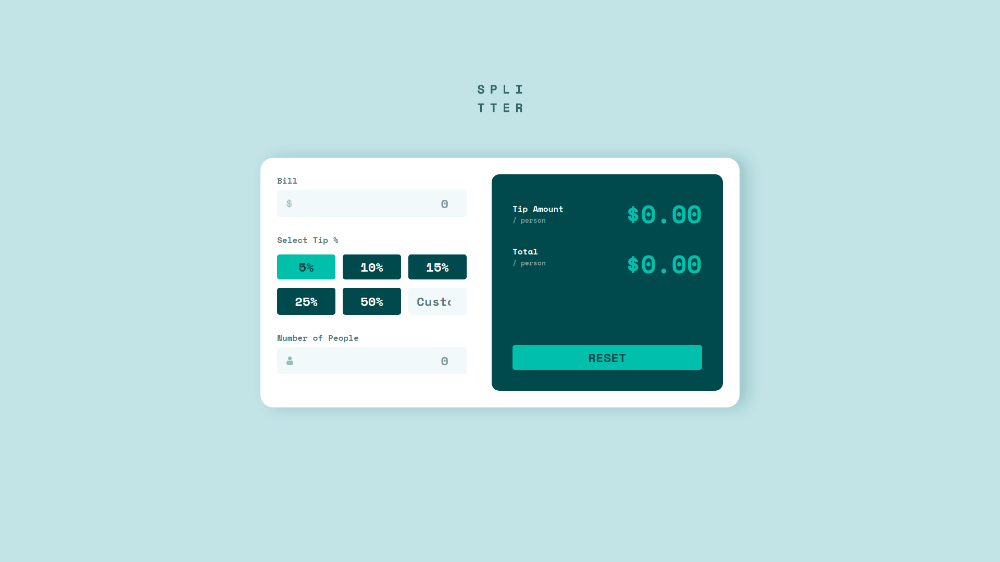

# Frontend Mentor - Tip calculator app solution

This is a solution to the [Tip calculator app challenge on Frontend Mentor](https://www.frontendmentor.io/challenges/tip-calculator-app-ugJNGbJUX). Frontend Mentor challenges help you improve your coding skills by building realistic projects.

## Table of contents

- [Overview](#overview)
  - [The challenge](#the-challenge)
  - [Screenshot](#screenshot)
  - [Links](#links)
- [My process](#my-process)
  - [Built with](#built-with)
  - [What I learned](#what-i-learned)
  - [Continued development](#continued-development)
  - [Useful resources](#useful-resources)
- [Author](#author)

## Overview

### The challenge

Users should be able to:

- View the optimal layout for the app depending on their device's screen size
- See hover states for all interactive elements on the page
- Calculate the correct tip and total cost of the bill per person

### Screenshot



### Links

- [Check out the solution](https://hamilton-i7.github.io/tip-calculator-react/)

## My process

### Built with

- Semantic HTML5 markup
- Sass and CSS modules
- Flexbox
- CSS Grid
- Mobile-first workflow
- [React](https://reactjs.org/) - JS library

### What I learned

I didn't previously know the property for changing the cursor's color within an input element.

```scss
$primary-color: #26c0ab;

input {
  caret-color: $primary-color-1;
}
```

### Continued development

Something I'm planning to keep on working is creating more reusable components.

### Useful resources

- [How to start a React app](https://reactjs.org/docs/create-a-new-react-app.html) - A step-by-step guide on how to start a React application.
- [Sass folder structure for React](https://dev.to/gedalyakrycer/ohsnap-sass-folder-structure-for-react-483e) - This is an amazing article which helped me structure my project.
- [Setup the correct version for Node Sass](https://stackoverflow.com/questions/64625050/error-node-sass-version-5-0-0-is-incompatible-with-4-0-0)

## Author

- Github - [Juan Hamilton](https://github.com/hamilton-i7)
- Frontend Mentor - [@hamilton-i7](https://www.frontendmentor.io/profile/hamilton-i7)
